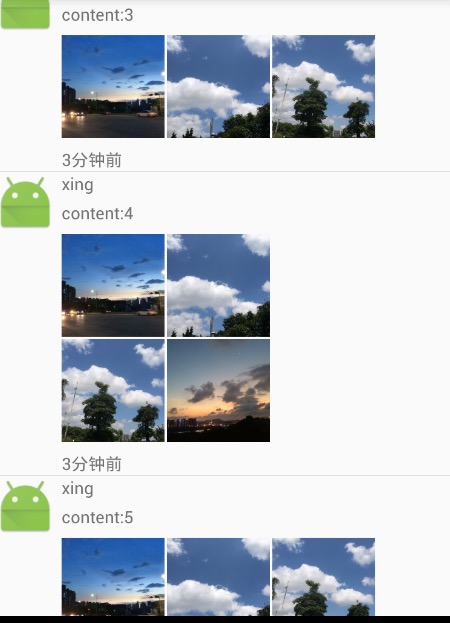

#XNineGridView
这是Android的一个控件,主要用于九宫格布局。玩过微信都知道微信朋友圈那个布局是很酷的,这个控件主要是仿微信的。

有问题可以在issue提出,或者到[我的博客](http://wiyi.org)留言

#功能说明

* 支持加载本地和网络图片
* 使用Adapter模式,你可以自由的对ImageView做任何操作
* 支持在xml布局

#属性
>gap | int  子view之间的间距（上下左右）

#示例
1. 在XML中使用

>\<org.wiyi.ninegridview.NineGridView
>	 android:layout_marginTop="8dp"
>     android:id="@+id/gallery"
>     android:layout\_height="wrap_content"
>     android:layout\_width="match_parent"
>     android:layout\_marginRight="20dp"
>     android:paddingRight="50dp"
>     ngl:gap="2dp"/>

不要忘了加上命名空间
>xmlns:ngl="http://schemas.android.com/apk/res-auto"

具体的demo请查看sample,这里不详细说了。

#联系方式
###Email: palinty[at]gmail.com
###blog: [http://wiyi.org](http://wiyi.org)
